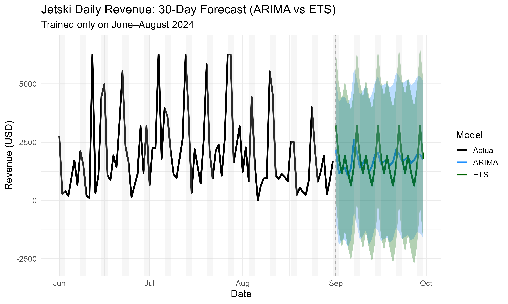

# Jetski Daily Revenue Forecast – 30 Day Outlook

**Model Comparison: ARIMA vs ETS**\
*Training Period: June–August 2024*\
*Forecast Horizon: 30 Days (September 2024)*

------------------------------------------------------------------------

## Forecast Plot

\
*Figure: Actual vs Forecasted Revenue using ARIMA and ETS with 95%
Confidence Intervals.*

-   Forecast begins at the end of August, marked by a vertical dashed
    line.
-   Shaded regions represent 95% confidence intervals.
-   Forecast models accurately capture **weekly seasonality**.
-   Weekends are visually emphasized for operational clarity.

------------------------------------------------------------------------

## Model Comparison Metrics

| Model     | AIC          | BIC          | LogLik      |
|-----------|--------------|--------------|-------------|
| **ARIMA** | **1533.930** | **1543.794** | **-762.97** |
| ETS       | 1684.814     | 1709.473     | -832.41     |

-   **AIC/BIC**: ARIMA has significantly lower values, indicating a
    better model fit with less complexity penalty.
-   **LogLik**: ARIMA's higher log-likelihood further confirms its
    superior performance.

------------------------------------------------------------------------

## Conclusion

The ARIMA model clearly outperforms ETS across all statistical
criteria: - Better **fit** - Lower **complexity penalty** - More
accurate **short-term seasonal forecast**

Both models captured the business-critical weekly revenue cycles, but
**ARIMA** showed significantly more reliable performance for this data.

This forecast will serve as a foundation for: - Operational planning
during the peak season - Budget allocation for targeted weekends -
Measuring actuals vs expectations in future months

------------------------------------------------------------------------

*Report generated using R, Python, `forecast`, `ggplot2`, and `tibble`.\
Plot trained on actual transaction data from Steel City Jet Ski
Rentals.*
