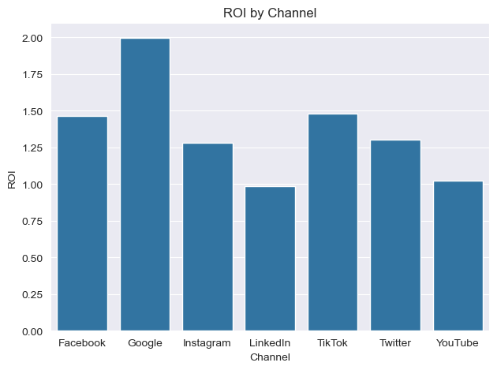

# Marketing Campaign ROI Analyzer

## Overview
This project integrates SQL and Python to analyze marketing campaign performance across multiple channels. It uses SQL to aggregate ad spend, clicks, and conversions, and Python to calculate and visualize ROI, CAC, and ROAS distributions.

## Folder Structure
```
marketing-roi-analyzer/
│
├── data/
│   ├── campaigns.csv
│   └── campaign_summary.csv
│
├── sql/
│   └── queries.sql
│
├── python/
│   └── roi_analysis.ipynb
│
├── plots/
│   ├── roi_by_channel.png
│   ├── cac_by_channel.png
│   └── spend_vs_roas.html
```

## Tech Stack
| Layer | Tools |
|-------|--------|
| Database | PostgreSQL / SQLite |
| Data Analysis | Python, Pandas |
| Visualization | Seaborn, Plotly |
| Notebook | JupyterLab / VSCode |

## SQL Summary
- Aggregates campaign metrics by channel  
- Calculates key marketing KPIs:
  - Conversion Rate  
  - Customer Acquisition Cost (CAC)  
  - Return on Investment (ROI)  
  - Return on Ad Spend (ROAS)

## Python Analysis
- Loads the aggregated SQL output  
- Visualizes ROI and CAC per channel  
- Plots Spend vs ROAS correlation using Plotly  
- Exports all charts to the /plots/ folder

## Insights
- Demonstrates how SQL and Python integrate for end-to-end marketing analytics.  
- Identifies top-performing channels and cost inefficiencies.  
- Provides a visual dashboard ready for stakeholder presentations.

## Example Output

